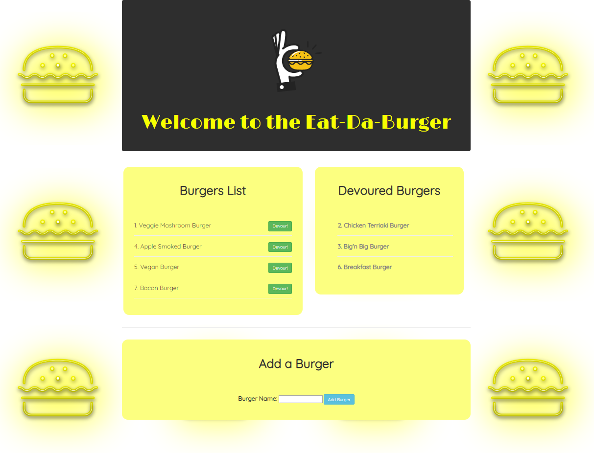
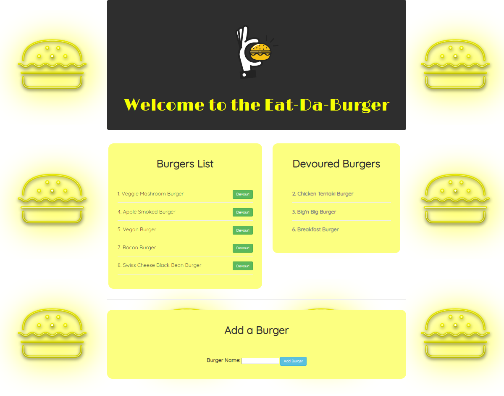
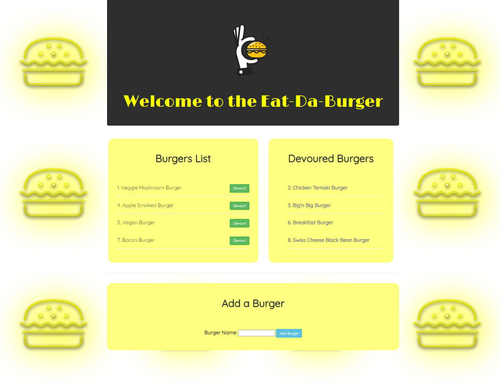

# Eat-Da-Burger
---------------
## Table of Contents
1. [Abstract](#abstract)
2. [Coding Overview](#overview)
3. [Application Display](#display)

## Abstract
Eat-Da-Burger is a restaurant app that users can add a burger name. Also once users add their burgers they can move their burgers to the devoured burgers category via clicking the "Devour" button.

Here is the link of the application : https://eat-da-burger-pnr.herokuapp.com/

## Coding Overview

The application is built with;

* JavaScript
* Node.js
* npm packages
* Express
* Handlebars
* ORM
* Heroku
* HTML
* Bootstrap
* MVC Design Pattern
* MySQL
* SQL

## Application Display

 

 

